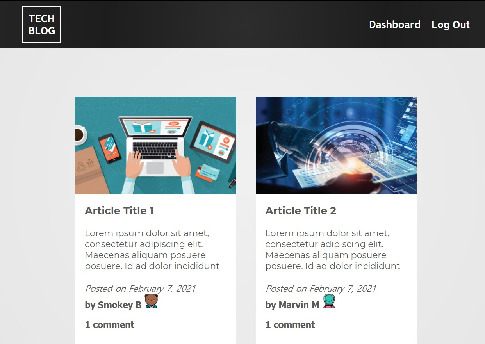

# Tech Blog

## Description and Purpose
A CMS-style blog site that allows users to create a user account, log into their user account, publish blog posts, and comment on other users' blog posts.

## Table of Contents
  - [Description and Purpose](#description-and-purpose)
  - [Application Screenshot](#application-screenshot)
  - [Deployed Application](#deployed-application)
  - [Built With](#built-with)
  - [License](#license)
  - [Contributing](#contributing)
  - [Tests](#tests)
  - [Questions](#questions)

## Application Screenshot

## Deployed Application
https://tech-blog.herokuapp.com/

## Built With
* JavaScript
* Node.js
* Express.js
* MySQL
* Sequalize
* Dotenv
* Handlebars.js
* HTML
* CSS
* Heroku
* JawsDB
* Bcrypt

## License
MIT License

## Contributing
Developed by Mike Shelby

## Tests
All API end points were tested using Insomnia Core. Utility functions were tested using Jest.

## Questions
Github Username: mikegshelby

Github Profile: https://github.com/mikegshelby

Email: mikegshelby@gmail.com

Please email me with any questions about this project!
